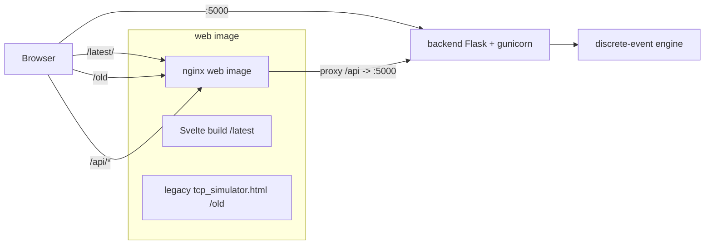

# TCP Sliding-Window Simulator

An educational simulator of TCP sliding-window flow control and congestion-control
algorithms. The backend computes a whole transmission run as a **discrete-event
trace** (instantly, in virtual time); the frontend plays that trace back as an
animated time-sequence diagram, a sliding-window map, and a congestion-window
chart.

Live layout when deployed: the new UI is served at `/latest/`, the original
single-file version at `/old`, and the REST API is reachable both through the
reverse proxy at `/api/` and directly on port `5000`.

---

## Table of Contents

- [Overview](#overview)
- [Architecture](#architecture)
- [How It Works](#how-it-works)
  - [Event-driven vs. real-time](#event-driven-vs-real-time)
  - [The three faces: `/old`, `/latest`, `/api`](#the-three-faces-old-latest-api)
- [REST API Reference](#rest-api-reference)
  - [`GET /health`](#get-health)
  - [`GET /schema`](#get-schema)
  - [`POST /simulate`](#post-simulate)
  - [Continuing a run (hybrid mode)](#continuing-a-run-hybrid-mode)
  - [Event schema](#event-schema)
- [Source Layout](#source-layout)
- [Sliding Window Protocols](#sliding-window-protocols)
  - [Common model](#common-model)
  - [Retransmission timeout (RFC 6298)](#retransmission-timeout-rfc-6298)
  - [Classic](#classic)
  - [Tahoe](#tahoe)
  - [Reno](#reno)
  - [CUBIC](#cubic)
- [Running Locally](#running-locally)
- [Deploying to Your Own VPS](#deploying-to-your-own-vps)
  - [Prerequisites](#prerequisites)
  - [Manual deployment](#manual-deployment)
  - [Where ports and paths are configured](#where-ports-and-paths-are-configured)
  - [Automated deployment (GitHub Actions)](#automated-deployment-github-actions)
- [Package Versions](#package-versions)
- [References](#references)
- [License](#license)

---

## Overview

The project demonstrates how the size of a TCP sender's window evolves as segments
are sent, acknowledged, delayed, and lost. Four congestion-control algorithms are
implemented — **Classic**, **Tahoe**, **Reno**, and **CUBIC** — over a common
sliding-window model with cumulative acknowledgements, duplicate-ACK detection,
fast retransmit, and an adaptive retransmission timer.

The system has three deployable parts:

- a **backend** (Python / Flask) that exposes a small REST API and contains the
  discrete-event simulation engine;
- a **frontend** (Svelte / Vite) that replays a computed trace;
- a **reverse proxy** (nginx) that serves both frontends and proxies the API.

---

## Architecture



Two container images are built:

- **`backend`** — `python:3.12-slim` running `gunicorn app:app` on port `5000`.
- **`web`** — a multi-stage image: a `node:20-alpine` stage builds the Svelte app,
  and an `nginx:alpine` stage serves the build under `/latest`, the legacy page
  under `/old`, and proxies `/api` to the backend.

---

## How It Works

### Event-driven vs. real-time

The **new** engine (`/api`, served to `/latest`) is a **discrete-event
simulation**. It maintains a virtual clock and a priority queue of future events
(`send`, `data arrival`, `ACK arrival`, `RTO`). It pops the earliest event,
mutates state, schedules new events, and repeats until the virtual clock reaches
the requested duration. A 30-second run is computed in a fraction of a second,
because nothing waits on wall-clock time.

By contrast, the **original** version (`/old`) advances in **real time**: its
client-side animation uses actual timers, so a 30-second scenario takes 30 seconds
to watch. (The first-generation backend prototype behaved the same way, using
`time.sleep`.) Moving to a discrete-event model is what makes the new API instant,
deterministic (seeded), and reproducible.

Because the engine is a pure function of `(config, seed, resume_state)`, the
backend keeps **no per-session state**. To *continue* a run, the client sends back
the `checkpoint` it received earlier — see
[Continuing a run](#continuing-a-run-hybrid-mode).

### The three faces: `/old`, `/latest`, `/api`

| Path        | What it serves                                            | Notes |
|-------------|-----------------------------------------------------------|-------|
| `/latest/`  | New Svelte trace player                                   | Built with `base=/latest/`, calls the API at `/api` |
| `/old`      | Original self-contained `tcp_simulator.html`              | Client-side, real-time animation; kept for reference |
| `/api/*`    | REST API through the nginx reverse proxy                  | Prefix `/api` is stripped before proxying |
| `:5000`     | REST API exposed directly on the port                    | Same API, for curl / scripting |

---

## REST API Reference

Base URL in production: `http://<host>/api` (proxied) or `http://<host>:5000`
(direct). In local development the frontend uses `http://localhost:5000`.

### `GET /health`

Liveness probe.

```bash
curl -s localhost:5000/health
# {"status": "ok"}
```

### `GET /schema`

Returns defaults, valid ranges, protocols, and retransmission modes. The frontend
builds its parameter form from this response.

```bash
curl -s localhost:5000/schema
```

```json
{
  "numeric": {
    "packetTime": { "default": 2500, "min": 100, "max": 10000 },
    "ackTime":    { "default": 1500, "min": 50,  "max": 5000  },
    "sendWindow": { "default": 4,    "min": 1,   "max": 64    },
    "recvWindow": { "default": 8,    "min": 1,   "max": 64    },
    "packetLoss": { "default": 5,    "min": 0,   "max": 50    },
    "ackLoss":    { "default": 2,    "min": 0,   "max": 50    },
    "timeout":    { "default": 8000, "min": 200, "max": 20000 },
    "bandwidth":  { "default": 10,   "min": 1,   "max": 100   }
  },
  "protocols": ["classic", "tahoe", "reno", "cubic"],
  "retransmitModes": ["gobackn", "selective"],
  "duration": { "default": 30, "min": 1, "max": 300 }
}
```

### `POST /simulate`

Runs a fresh simulation and returns the full event trace, a resumable checkpoint,
and summary statistics.

Request body:

| Field          | Type    | Required | Meaning |
|----------------|---------|----------|---------|
| `config`       | object  | no       | Any subset of the schema parameters; missing values use defaults |
| `duration`     | number  | no       | Seconds of *additional* virtual time to simulate (default 30) |
| `seed`         | integer | no       | PRNG seed for reproducibility (default 1) |
| `resume_state` | object  | no       | A `checkpoint` from a previous call (see below) |

```bash
curl -s -X POST localhost:5000/simulate \
  -H 'Content-Type: application/json' \
  -d '{
    "config": { "protocol": "reno", "packetLoss": 8, "bandwidth": 10,
                "packetTime": 300, "ackTime": 150, "sendWindow": 2 },
    "duration": 10,
    "seed": 42
  }'
```

Response shape:

```json
{
  "events": [
    { "t": 0.0,   "type": "cwnd_change", "value": 2, "phase": "slow-start", "reason": "init" },
    { "t": 0.0,   "type": "packet_send", "seq": 0, "retransmit": false },
    { "t": 300.0, "type": "packet_deliver", "seq": 0 },
    { "t": 450.0, "type": "ack_deliver", "ack": 1 }
  ],
  "checkpoint": { "...": "opaque, send back to continue" },
  "stats": { "sent": 50, "delivered": 47, "lost": 3, "ackSent": 47,
             "ackDelivered": 46, "ackLost": 1, "retransmits": 1 }
}
```

Validation errors return `400` with an `{"error": "..."}` body; an oversized trace
returns `413`.

### Continuing a run (hybrid mode)

To extend a run, send the previous `checkpoint` as `resume_state`. The new
`config` may differ — the continuation reflects the new parameters from that point
on, while packets already in flight keep their decided fate. This is what powers
"Continue with new parameters" in the UI.

```bash
# 1) fresh run, save the response
curl -s -X POST localhost:5000/simulate -H 'Content-Type: application/json' \
  -d '{"config":{"protocol":"reno","packetLoss":8},"duration":10,"seed":42}' > run1.json

# 2) continue for 10 more seconds, switching to CUBIC with heavier loss
jq -c '{config:{protocol:"cubic",packetLoss:20},duration:10,resume_state:.checkpoint}' run1.json \
  | curl -s -X POST localhost:5000/simulate -H 'Content-Type: application/json' -d @-
```

The continuation's events start at the virtual time where the first run ended;
the client concatenates them into one continuous timeline.

### Event schema

Every event carries `t` (virtual milliseconds) and a `type`:

| Type               | Payload            | Meaning |
|--------------------|--------------------|---------|
| `packet_send`      | `seq`, `retransmit`| A data segment leaves the sender |
| `fast_retransmit`  | `seq`              | Segment retransmitted after 3 duplicate ACKs |
| `packet_deliver`   | `seq`              | Segment arrives at the receiver |
| `packet_drop`      | `seq`              | Segment lost in the network |
| `ack_send`         | `ack`              | Receiver emits a cumulative ACK |
| `ack_deliver`      | `ack`              | ACK arrives at the sender |
| `ack_drop`         | `ack`              | ACK lost |
| `dup_ack`          | `ack`, `count`     | Duplicate ACK observed by the sender |
| `timeout`          | `seq`              | Retransmission timer fired |
| `cwnd_change`      | `value`, `phase`, `reason` | Congestion window changed |
| `ssthresh_change`  | `value`            | Slow-start threshold changed |
| `phase_change`     | `phase`            | slow-start / congestion-avoidance / fast-recovery |

---

## Source Layout

```
backend/
  app.py                 Flask API: /health, /schema, /simulate
  requirements.txt
  Dockerfile
  engine/
    prng.py              Deterministic splitmix64 PRNG (serializable state)
    rto.py               Adaptive RTO estimator (RFC 6298)
    config.py            Config dataclass + parameter schema + validation
    congestion.py        Congestion-control strategies (classic/tahoe/reno/cubic)
    core.py              Discrete-event engine + simulate() entry point

frontend/                New UI (Svelte + Vite)
  index.html
  vite.config.js         base is '/' in dev, '/latest/' in the production build
  src/
    App.svelte           Layout + API orchestration
    lib/
      api.js             getSchema / runSimulation / continueSimulation
      trace.js           Trace processing: flights + state timeline (pure, tested)
      player.js          Playback store: virtual clock, play/pause/seek/speed
      layout.js          Shared time axis for the ladder and the chart
    components/
      ConfigPanel.svelte     Parameter form (built from /schema)
      StateStrip.svelte      Protocol / phase / cwnd / counters readout
      SlidingWindow.svelte   Sequence-space window strip
      Ladder.svelte          Time-sequence (ladder) diagram
      WindowChart.svelte     cwnd / ssthresh over time
      Transport.svelte       Play / pause / speed / scrub
      LogPanel.svelte        Event log synced to the playhead

legacy/
  tcp_simulator.html     Original single-file simulator (served at /old)

nginx/
  Dockerfile             Multi-stage: build Svelte, then nginx runtime
  nginx.conf             Routes /latest, /old, /api

docker-compose.yml       Local build
docker-compose.prod.yml  Pull prebuilt images from GHCR (used on the server)
.github/workflows/deploy.yml
```

Key backend building blocks:

- **`engine/core.py`** holds the `Engine` class (the event queue, sender, receiver,
  loss injection, loss detection) and `simulate()`, the pure function the API calls.
  The `checkpoint()` / `resume()` pair serializes and restores *all* state,
  including the pending event queue and the PRNG, which is what makes stateless
  "continue" possible.
- **`engine/congestion.py`** isolates each algorithm behind a small `CC` interface
  (`on_new_ack`, `on_triple_dup_ack`, `on_timeout`). Congestion control is entirely
  sender-side; the receiver logic lives in the engine and is shared by all four.
- **`engine/rto.py`** implements the adaptive timer described below.

On the frontend, `lib/trace.js` is deliberately free of Svelte and DOM so it can be
unit-tested; it converts the flat event list into paired "flights" (for the ladder)
and a per-event state timeline (for the readouts, chart, and window strip).

---

## Sliding Window Protocols

This section describes the algorithms as implemented in the **latest** engine,
which is the authoritative one. Congestion control affects the **sender**; the
**receiver** behaves the same across all four protocols and depends only on the
retransmission mode.

### Common model

**What we emulate.** A one-way data channel with propagation delay `packetTime`
(ms) and a return channel with delay `ackTime` (ms), a bottleneck that serializes
segments at `bandwidth` segments/second, and independent stochastic loss of data
(`packetLoss` %) and ACKs (`ackLoss` %). Sequence numbers count segments.

**Sender (common behaviour).**

1. Keeps `cwnd` (congestion window), `ssthresh` (slow-start threshold),
   `sendBase` (oldest unacknowledged segment), and `nextSeq` (next segment to
   send).
2. May send while `nextSeq - sendBase < min(cwnd, recvWindow)` — i.e. the effective
   window is the smaller of congestion window and the receiver's advertised window
   (flow control). New segments are spaced by the link serialization time.
3. On a new **cumulative** ACK: advances `sendBase`, takes an RTT sample (unless the
   acknowledged segment was retransmitted — see Karn's rule), updates `cwnd`
   according to the protocol, and restarts the RTO timer.
4. On the **third duplicate** ACK: performs a **fast retransmit** of `sendBase` and
   applies the protocol's loss reaction.
5. On **RTO expiry**: applies the protocol's timeout reaction, backs off the timer,
   and retransmits. In **go-back-n** the sender rewinds `nextSeq` to `sendBase` and
   resends the window; in **selective repeat** it resends only `sendBase`.

**Receiver (common behaviour).**

1. Tracks `expected`, the next in-order sequence number.
2. On an in-order segment: advances `expected` (absorbing any buffered contiguous
   segments) and sends a cumulative ACK for the new `expected`.
3. On an out-of-order segment: in **go-back-n** it is discarded and the receiver
   re-sends an ACK for the current `expected` (a duplicate ACK); in **selective
   repeat** it is buffered if it fits within `recvWindow`, and a duplicate ACK is
   still sent.
4. ACKs themselves may be lost according to `ackLoss`.

The sliding-window mechanics and Go-Back-N / Selective-Repeat behaviour follow the
classic reliable-transport model (see RFC 9293 and the textbook references).

### Retransmission timeout (RFC 6298)

The RTO is adaptive, following **RFC 6298**. The sender keeps a smoothed RTT
(`SRTT`) and its variation (`RTTVAR`):

```
first sample R:   SRTT = R;  RTTVAR = R/2
later samples R':  RTTVAR = (1 - 1/4)*RTTVAR + 1/4*|SRTT - R'|
                   SRTT   = (1 - 1/8)*SRTT   + 1/8*R'
RTO = SRTT + max(G, 4 * RTTVAR)          # clamped to [RTO_min, RTO_max]
```

Two rules matter for correctness:

- **Karn's algorithm** — RTT is never sampled from a retransmitted segment, because
  it is ambiguous which copy an ACK answers (Karn & Partridge, 1987).
- **Exponential backoff** — when the timer fires, the RTO is doubled before the
  retransmission.

The `timeout` parameter seeds the initial RTO; it then converges toward the
channel's real RTT.

### Classic

A fixed-window baseline with **no congestion control**. Useful for contrast.

- **Sender:** `cwnd` is pinned to `sendWindow` and never changes. On loss the
  sender still retransmits (reliability is preserved), but neither `cwnd` nor
  `ssthresh` react to duplicate ACKs or timeouts.
- **Receiver:** standard cumulative-ACK behaviour.

### Tahoe

Slow start, AIMD congestion avoidance, and fast retransmit — but **no fast
recovery**. Any loss collapses the window to 1. Based on Jacobson (1988); see
RFC 5681 for the modern statement.

- **Sender:**
  - *Slow start* (`cwnd < ssthresh`): `cwnd += 1` per new ACK (roughly doubling per
    RTT).
  - *Congestion avoidance* (`cwnd ≥ ssthresh`): `cwnd += 1/cwnd` per new ACK
    (about +1 per RTT).
  - *On 3 duplicate ACKs*: `ssthresh = max(cwnd/2, 2)`, `cwnd = 1`, re-enter slow
    start, fast-retransmit the missing segment.
  - *On timeout*: identical reaction — `ssthresh = max(cwnd/2, 2)`, `cwnd = 1`,
    slow start.
- **Receiver:** common cumulative-ACK behaviour.

### Reno

Tahoe plus **fast recovery**: three duplicate ACKs halve the window instead of
resetting it, keeping the pipe partially full. See RFC 5681 and the NewReno
refinement in RFC 6582.

- **Sender:**
  - Slow start and congestion avoidance as in Tahoe.
  - *On 3 duplicate ACKs*: `ssthresh = max(cwnd/2, 2)`, `cwnd = ssthresh + 3`
    (window inflation), enter *fast recovery*, fast-retransmit.
  - *While in fast recovery*: each further duplicate ACK inflates `cwnd` by 1 and
    may release a new segment.
  - *On the next new ACK*: deflate to `cwnd = ssthresh` and return to congestion
    avoidance.
  - *On timeout*: fall back to `cwnd = 1` and slow start (same as Tahoe).
- **Receiver:** common cumulative-ACK behaviour.

### CUBIC

A window-growth function that is cubic in the time since the last congestion
event, designed for high-bandwidth, long-delay paths. Standardised in
**RFC 9438** (Standards Track), which obsoletes the earlier informational
RFC 8312. Constants: `C = 0.4`, `β_cubic = 0.7`, and
`α_cubic = 3(1 − β)/(1 + β) ≈ 0.53`.

- **Sender:**
  - *Slow start*: as in Reno (`cwnd += segments_acked` per new ACK). HyStart++
    (§4.10) is not used; plain slow start is the permitted fallback.
  - *Congestion avoidance* (§4.2, §4.4, §4.5): at the start of each CA stage the
    sender fixes `t_epoch`, `cwnd_epoch`, `W_max`, and
    `K = ∛((W_max − cwnd_epoch) / C)`. On every ACK it evaluates the cubic
    function one RTT ahead,
    `W_cubic(t + RTT) = C · (t + RTT − K)³ + W_max`, clamps the result to
    `[cwnd, 1.5 · cwnd]`, and advances `cwnd += (target − cwnd) / cwnd`. Growth is
    *concave* while `cwnd < W_max` (approaching the previous saturation point) and
    *convex* afterwards (probing for more bandwidth).
  - *Reno-friendly region* (§4.3): in parallel the sender maintains a Reno
    estimate, `W_est += α_cubic · segments_acked / cwnd`, starting from
    `cwnd_epoch`, with `α_cubic` switching to `1` once `W_est ≥ cwnd_prior`.
    Whenever the cubic curve would grow more slowly than Reno, `cwnd` is set to
    `W_est` instead — this keeps CUBIC no less aggressive than Reno on short-RTT
    paths.
  - *On 3 duplicate ACKs* (§4.6): `cwnd_prior = cwnd`,
    `ssthresh = max(flight_size · β_cubic, 2)` (note the reduction is based on
    **flight_size**, not `cwnd`, and the factor is 0.7 — not one half),
    `cwnd = cwnd · β_cubic`, enter fast recovery, fast-retransmit. The next CA
    stage then probes back toward `W_max = cwnd_prior`.
  - *On timeout* (§4.8): `cwnd` collapses to 1 and the sender re-enters slow start
    (as in Reno), but `ssthresh` is set with `β_cubic` rather than one half. The
    first CA stage after a timeout uses `K = 0` and `W_max = cwnd` at CA entry
    (§4.8, §4.10).
- **Receiver:** common cumulative-ACK behaviour.

> **Scope note.** *Fast convergence* (§4.7) is intentionally not implemented: it
> only affects how several CUBIC flows share a bottleneck, and RFC 9438 states it
> SHOULD be disabled for a single flow — which is exactly what this simulator
> models. RTT-fairness and Reno-vs-CUBIC competition (§3.3, §5.1) are likewise out
> of scope for a single-flow model, and the optional mechanisms PRR (RFC 6937) and
> spurious-loss reversal (§4.9) are not used.

---

## Running Locally

Two processes: the API and the frontend dev server.

**Backend:**

```bash
cd backend
python3 -m venv .venv
source .venv/bin/activate
pip install -r requirements.txt
python app.py                # http://localhost:5000
```

**Frontend:**

```bash
cd frontend
cp .env.example .env          # VITE_API_BASE=http://localhost:5000
npm install
npm run dev                   # http://localhost:5173
```

Or run the whole stack the way it runs in production, with Docker:

```bash
docker compose up --build
# http://localhost/latest/   new UI
# http://localhost/old       legacy page
# http://localhost/api/schema  API via proxy
# http://localhost:5000/schema API direct
```

---

## Deploying to Your Own VPS

This walks through a manual deployment from a clean server to a running system.

### Prerequisites

- A VPS with Docker Engine and the Docker Compose plugin installed.
- Git.
- Port `80` (and `5000` if you want the API exposed directly) open in both the
  host firewall and any provider-side firewall.
- No other service already bound to port `80` (a system nginx, for example, must
  be stopped: `sudo systemctl stop nginx && sudo systemctl disable nginx`).

### Manual deployment

```bash
# 1. Clone
sudo mkdir -p /path/to/repo/dir && sudo chown "$USER" /path/to/repo/dir
git clone https://github.com/UsamG1t/TCP-Web.git /path/to/repo/dir
cd /path/to/repo/dir

# 2. Build the images locally and start
docker compose up --build -d

# 3. Verify
curl -s localhost:5000/health          # {"status":"ok"}
curl -sI localhost/latest/ | head -1    # 200 OK
curl -sI localhost/old | head -1        # 302 -> /old/
docker compose ps
```

Then browse to:

- `http://<VPS_IP>/latest/` — the new simulator
- `http://<VPS_IP>/old` — the legacy page
- `http://<VPS_IP>/api/schema` — the API through the proxy
- `http://<VPS_IP>:5000/schema` — the API directly on its port

To update later: `git pull && docker compose up --build -d`.

### Where ports and paths are configured

| To change...                        | Edit |
|-------------------------------------|------|
| Host ports (`80`, `5000`)           | `docker-compose.yml` / `docker-compose.prod.yml` → `ports:` |
| URL paths (`/latest`, `/old`, `/api`) | `nginx/nginx.conf` → `location` blocks |
| The frontend's base path            | `nginx/Dockerfile` → `ENV VITE_BASE` (build arg) |
| The API URL the frontend calls      | `nginx/Dockerfile` → `ENV VITE_API_BASE` (build) / `frontend/.env` (dev) |
| Backend workers / bind              | `backend/Dockerfile` → `gunicorn` command |

For example, to serve the new UI at `/app` instead of `/latest`, change the
`location /latest/` block in `nginx.conf`, the `COPY --from=build ... /latest/`
line in `nginx/Dockerfile`, and `ENV VITE_BASE=/app/`.

---

## Package Versions

**Backend**

| Package     | Version   |
|-------------|-----------|
| Python      | 3.12      |
| Flask       | >= 3.0    |
| flask-cors  | >= 4.0    |
| gunicorn    | >= 21.2   |

**Frontend**

| Package                     | Version    |
|-----------------------------|------------|
| Node.js                     | 20         |
| Svelte                      | ^4.2.18    |
| Vite                        | ^5.3.4     |
| @sveltejs/vite-plugin-svelte| ^3.1.1     |

**Container base images:** `python:3.12-slim`, `node:20-alpine`, `nginx:alpine`.

---

## References

Standards:

- RFC 9293 — *Transmission Control Protocol (TCP)*. <https://www.rfc-editor.org/rfc/rfc9293.html>
- RFC 5681 — *TCP Congestion Control* (slow start, congestion avoidance, fast retransmit/recovery). <https://www.rfc-editor.org/rfc/rfc5681.html>
- RFC 6582 — *The NewReno Modification to TCP's Fast Recovery Algorithm*. <https://www.rfc-editor.org/rfc/rfc6582.html>
- RFC 6298 — *Computing TCP's Retransmission Timer*. <https://www.rfc-editor.org/rfc/rfc6298.html>
- RFC 9438 — *CUBIC for Fast and Long-Distance Networks*. <https://www.rfc-editor.org/rfc/rfc9438.html>
- RFC 8312 — *CUBIC for Fast Long-Distance Networks* (obsoleted by RFC 9438). <https://www.rfc-editor.org/rfc/rfc8312.html>
- RFC 9406 — *HyStart++: Modified Slow Start for TCP*. <https://www.rfc-editor.org/rfc/rfc9406.html>
- RFC 6937 — *Proportional Rate Reduction for TCP*. <https://www.rfc-editor.org/rfc/rfc6937.html>

Papers:

- V. Jacobson, *Congestion Avoidance and Control*, SIGCOMM 1988. <https://ee.lbl.gov/papers/congavoid.pdf>
- P. Karn, C. Partridge, *Improving Round-Trip Time Estimates in Reliable Transport Protocols*, SIGCOMM 1987. <https://dl.acm.org/doi/10.1145/55483.55484>

---

## License

This project is licensed under the **GNU General Public License v3.0 (GPLv3)**.
See the [LICENSE](LICENSE) file for the full text.
