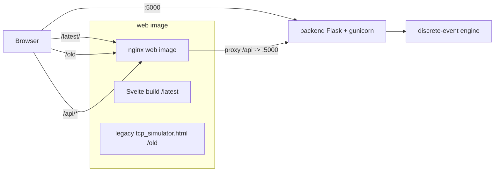

# TCP Sliding-Window Simulator

An educational simulator of TCP sliding-window flow control and congestion
control. The backend computes a run as a discrete-event trace; the `/latest`
frontend replays it, and the `/old` page runs the same rules live in the browser
with click-to-drop packets.

> **This file is generated.** Edit the chapters in [`docs/info/`](docs/info) and
> run `python3 docs/_tools/build_readme.py`. Do not edit README.md by hand.

Full documentation site: the chapters below are also published via Jekyll /
GitHub Pages under `docs/`.

## Table of Contents

- [Overview](#overview)
- [Architecture](#architecture)
- [How It Works](#how-it-works)
- [REST API](#rest-api)
- [Sliding Window Protocols](#sliding-window-protocols)
- [Deploying to Your Own VPS](#deploying-to-your-own-vps)
- [Package Versions](#package-versions)
- [References](#references)
- [License](#license)

## Overview

The project demonstrates how a TCP sender's window evolves as segments are sent,
acknowledged, delayed, and lost. Four congestion-control algorithms are
implemented — Classic, Tahoe, Reno, and CUBIC — over a common sliding-window model
with cumulative acknowledgements, duplicate-ACK detection, fast retransmit, and an
adaptive retransmission timer (RFC 6298).

The system has three deployable parts:

- a **backend** (Python / Flask) exposing a small REST API and containing the
  discrete-event simulation engine;
- a **frontend** (Svelte / Vite) that replays a computed trace;
- a **reverse proxy** (nginx) that serves both frontends and proxies the API.

When deployed, the trace player is served at `/latest/`, the interactive
click-to-drop simulator at `/old`, and the REST API is reachable both through the
reverse proxy at `/api/` and directly on port `5000`.

## Architecture



Two container images are built:

- **`backend`** — `python:3.12-slim` running `gunicorn app:app` on port `5000`.
- **`web`** — a multi-stage image: a `node:20-alpine` stage builds the Svelte app,
  and an `nginx:alpine` stage serves the build under `/latest`, the legacy page
  under `/old`, and proxies `/api` to the backend.

The simulation logic lives once, in `backend/engine`, and is mirrored by a
JavaScript port used by the `/old` page — see [How It Works](#how-it-works).

## How It Works

### Event-driven vs. real-time

Both frontends run the **same congestion-control rules**. They differ only in how
the clock advances.

The **backend engine** (`backend/engine`, reached through the API and used by
`/latest`) is a **discrete-event simulation**. It keeps a virtual clock and a
priority queue of future events (`send`, data arrival, ACK arrival, `RTO`). It
pops the earliest event, mutates state, schedules new events, and repeats until
the virtual clock reaches the requested duration. A 30-second run is computed in a
fraction of a second, because nothing waits on wall-clock time. Runs are seeded and
reproducible, and because the engine is a pure function of
`(config, seed, resume_state)` the backend keeps **no per-session state**.

The **interactive page** (`legacy/tcp_simulator.html`, served at `/old`) is a
JavaScript **port of that same engine** — same PRNG, same RTO estimator, same
congestion-control strategies, same sender and receiver. The only difference is
that its event queue is *paced*: events are released as a real clock advances,
scaled by the speed slider. That is what makes packets watchable in flight and
lets a user **drop a packet by clicking it** — a manual drop flips the `lost` flag
on an already scheduled arrival, so from TCP's point of view it is an ordinary
loss, and duplicate ACKs, fast retransmit, or an RTO follow on their own.

An earlier prototype advanced in real time on the server (using `time.sleep`),
which made a 30-second request block for 30 seconds. The discrete-event model
replaced it.

> **Cross-validated.** Given the same configuration and seed, and with no manual
> drops, the JavaScript engine produces an event trace **identical** to the Python
> engine's — event for event, including timestamps. `/old` and `/latest` are two
> views of one model, not two models.

### The three faces: `/old`, `/latest`, `/api`

| Path        | What it serves                              | Notes |
|-------------|---------------------------------------------|-------|
| `/latest/`  | Svelte trace player                         | Computes a trace via the API, then replays it: ladder diagram, sliding-window strip, cwnd chart, scrubbing |
| `/old`      | Interactive single-file simulator           | Runs the ported engine live in the browser; packets can be **dropped by clicking them** mid-flight. No build step, no API calls |
| `/api/*`    | REST API through the nginx reverse proxy    | Prefix `/api` is stripped before proxying |
| `:5000`     | REST API exposed directly on the port       | Same API, for curl / scripting |

## REST API

Base URL in production: `http://<host>/api` (proxied) or `http://<host>:5000`
(direct). In local development the frontend uses `http://localhost:5000`.

### `GET /health`

Liveness probe.

```bash
curl -s localhost:5000/health
# {"status": "ok"}
```

### `GET /schema`

Returns defaults, valid ranges, protocols, and retransmission modes. The frontend
builds its parameter form from this response.

```json
{
  "numeric": {
    "packetTime": { "default": 2500, "min": 100, "max": 10000 },
    "ackTime":    { "default": 1500, "min": 50,  "max": 5000  },
    "sendWindow": { "default": 4,    "min": 1,   "max": 64    },
    "recvWindow": { "default": 8,    "min": 1,   "max": 64    },
    "packetLoss": { "default": 5,    "min": 0,   "max": 50    },
    "ackLoss":    { "default": 2,    "min": 0,   "max": 50    },
    "timeout":    { "default": 8000, "min": 200, "max": 20000 },
    "bandwidth":  { "default": 10,   "min": 1,   "max": 100   }
  },
  "protocols": ["classic", "tahoe", "reno", "cubic"],
  "retransmitModes": ["gobackn", "selective"],
  "duration": { "default": 30, "min": 1, "max": 300 }
}
```

### `POST /simulate`

Runs a fresh simulation and returns the full event trace, a resumable checkpoint,
and summary statistics.

| Field          | Type    | Required | Meaning |
|----------------|---------|----------|---------|
| `config`       | object  | no       | Any subset of the schema parameters; missing values use defaults |
| `duration`     | number  | no       | Seconds of *additional* virtual time to simulate (default 30) |
| `seed`         | integer | no       | PRNG seed for reproducibility (default 1) |
| `resume_state` | object  | no       | A `checkpoint` from a previous call |

```bash
curl -s -X POST localhost:5000/simulate \
  -H 'Content-Type: application/json' \
  -d '{"config":{"protocol":"reno","packetLoss":8},"duration":10,"seed":42}'
```

Response: `{ "events": [...], "checkpoint": {...}, "stats": {...} }`. Validation
errors return `400`; an oversized trace returns `413`.

### Continuing a run (hybrid mode)

To extend a run, send the previous `checkpoint` back as `resume_state`. The new
`config` may differ — the continuation reflects the new parameters from that point
on, while packets already in flight keep their decided fate. This powers "Continue
with new parameters" in the UI.

```bash
curl -s -X POST localhost:5000/simulate -H 'Content-Type: application/json' \
  -d '{"config":{"protocol":"reno","packetLoss":8},"duration":10,"seed":42}' > run1.json

jq -c '{config:{protocol:"cubic",packetLoss:20},duration:10,resume_state:.checkpoint}' run1.json \
  | curl -s -X POST localhost:5000/simulate -H 'Content-Type: application/json' -d @-
```

### Event schema

Every event carries `t` (virtual milliseconds) and a `type`:

| Type               | Payload             | Meaning |
|--------------------|---------------------|---------|
| `packet_send`      | `seq`, `retransmit` | A data segment leaves the sender |
| `fast_retransmit`  | `seq`               | Segment retransmitted after 3 duplicate ACKs |
| `packet_deliver`   | `seq`               | Segment arrives at the receiver |
| `packet_drop`      | `seq`               | Segment lost in the network |
| `ack_send`         | `ack`               | Receiver emits a cumulative ACK |
| `ack_deliver`      | `ack`               | ACK arrives at the sender |
| `ack_drop`         | `ack`               | ACK lost |
| `dup_ack`          | `ack`, `count`      | Duplicate ACK observed by the sender |
| `timeout`          | `seq`               | Retransmission timer fired |
| `cwnd_change`      | `value`, `phase`, `reason` | Congestion window changed |
| `ssthresh_change`  | `value`             | Slow-start threshold changed |
| `phase_change`     | `phase`             | slow-start / congestion-avoidance / fast-recovery |

## Sliding Window Protocols

There is only one set of rules: the Python engine (`backend/engine`) and its
JavaScript port (`legacy/tcp_simulator.html`) implement the same behaviour and are
verified to produce identical traces, so everything below applies equally to
`/latest` and `/old`. Congestion control affects the **sender**; the **receiver**
behaves the same across all four protocols and depends only on the retransmission
mode.

### Common model

**What we emulate.** A one-way data channel with propagation delay `packetTime`,
a return channel with delay `ackTime`, a bottleneck that serializes segments at
`bandwidth` segments/second, and independent stochastic loss of data
(`packetLoss` %) and ACKs (`ackLoss` %). Sequence numbers count segments.

**Sender (common behaviour).**

1. Keeps `cwnd`, `ssthresh`, `sendBase` (oldest unacknowledged segment), and
   `nextSeq`.
2. May send while `nextSeq - sendBase < min(cwnd, recvWindow)` — the effective
   window is the smaller of congestion window and the receiver's advertised
   window. New segments are spaced by the link serialization time.
3. On a new cumulative ACK: advances `sendBase`, takes an RTT sample (unless the
   acknowledged segment was retransmitted — Karn's rule), updates `cwnd` per the
   protocol, and restarts the RTO timer.
4. On the third duplicate ACK: fast-retransmits `sendBase` and applies the
   protocol's loss reaction.
5. On RTO expiry: applies the protocol's timeout reaction, backs off the timer,
   and retransmits. In **go-back-n** it rewinds `nextSeq` to `sendBase` and resends
   the window; in **selective repeat** it resends only `sendBase`.

**Receiver (common behaviour).** Tracks `expected`. In-order segments advance
`expected` and are cumulatively acknowledged; out-of-order segments are discarded
(go-back-n) or buffered within `recvWindow` (selective repeat), and a duplicate ACK
is sent. ACKs may be lost according to `ackLoss`.

### Retransmission timeout (RFC 6298)

The RTO is adaptive. The sender keeps a smoothed RTT (`SRTT`) and its variation
(`RTTVAR`):

```
first sample R:   SRTT = R;  RTTVAR = R/2
later samples R':  RTTVAR = (1 - 1/4)*RTTVAR + 1/4*|SRTT - R'|
                   SRTT   = (1 - 1/8)*SRTT   + 1/8*R'
RTO = SRTT + max(G, 4 * RTTVAR)          # clamped to [RTO_min, RTO_max]
```

**Karn's algorithm** — RTT is never sampled from a retransmitted segment.
**Exponential backoff** — the RTO doubles when the timer fires. The `timeout`
parameter seeds the initial RTO; it then converges toward the channel's real RTT.

### Classic

A fixed-window baseline with no congestion control.

- **Sender:** `cwnd` is pinned to `sendWindow` and never changes. Loss still
  triggers retransmission (reliability is preserved), but the window never reacts.
- **Receiver:** standard cumulative-ACK behaviour.

### Tahoe

Slow start, AIMD congestion avoidance, and fast retransmit — but no fast recovery.
Any loss collapses the window to 1 (Jacobson 1988; RFC 5681).

- **Sender:** slow start (`cwnd += 1` per ACK) until `ssthresh`, then congestion
  avoidance (`cwnd += 1/cwnd` per ACK). On 3 duplicate ACKs *or* a timeout:
  `ssthresh = max(cwnd/2, 2)`, `cwnd = 1`, re-enter slow start (fast-retransmit on
  the duplicate-ACK path).

### Reno

Tahoe plus fast recovery: three duplicate ACKs halve the window instead of
resetting it (RFC 5681; NewReno, RFC 6582).

- **Sender:** slow start and congestion avoidance as in Tahoe. On 3 duplicate ACKs:
  `ssthresh = max(cwnd/2, 2)`, `cwnd = ssthresh + 3`, enter fast recovery,
  fast-retransmit; each further duplicate ACK inflates `cwnd` by 1; the next new ACK
  deflates to `cwnd = ssthresh` and returns to congestion avoidance. On timeout:
  `cwnd = 1`, slow start.

### CUBIC

A window-growth function that is cubic in the time since the last congestion
event, for high-bandwidth, long-delay paths. Standardised in **RFC 9438** (which
obsoletes RFC 8312). Constants: `C = 0.4`, `β_cubic = 0.7`,
`α_cubic = 3(1 − β)/(1 + β) ≈ 0.53`.

- **Sender:**
  - *Slow start*: as in Reno (`cwnd += segments_acked`). HyStart++ (§4.10) is not
    used; plain slow start is the permitted fallback.
  - *Congestion avoidance* (§4.2, §4.4, §4.5): at the start of each CA stage the
    sender fixes `t_epoch`, `cwnd_epoch`, `W_max`, and
    `K = ∛((W_max − cwnd_epoch)/C)`. On every ACK it evaluates the cubic function
    one RTT ahead, `W_cubic(t + RTT) = C·(t + RTT − K)³ + W_max`, clamps the result
    to `[cwnd, 1.5·cwnd]`, and advances `cwnd += (target − cwnd)/cwnd`. Growth is
    *concave* while `cwnd < W_max` and *convex* afterwards.
  - *Reno-friendly region* (§4.3): in parallel it maintains
    `W_est += α_cubic · segments_acked / cwnd` from `cwnd_epoch`, with `α_cubic → 1`
    once `W_est ≥ cwnd_prior`. When the cubic curve would grow more slowly than
    Reno, `cwnd` is set to `W_est` instead.
  - *On 3 duplicate ACKs* (§4.6): `ssthresh = max(flight_size · β_cubic, 2)` (the
    reduction is based on **flight_size**, and the factor is 0.7 — not one half),
    `cwnd = cwnd · β_cubic`, enter fast recovery, fast-retransmit; the next CA stage
    probes back toward `W_max = cwnd_prior`.
  - *On timeout* (§4.8): `cwnd` collapses to 1 and slow start resumes, but
    `ssthresh` is set with `β_cubic` rather than one half; the first CA stage
    afterwards uses `K = 0`.
- **Receiver:** common cumulative-ACK behaviour.

> **Scope note.** *Fast convergence* (§4.7) is intentionally not implemented: it
> only affects how several CUBIC flows share a bottleneck, and RFC 9438 states it
> SHOULD be disabled for a single flow — which is what this simulator models.
> RTT-fairness and Reno-vs-CUBIC competition (§3.3, §5.1) are likewise out of scope
> for a single-flow model, and the optional mechanisms PRR (RFC 6937) and
> spurious-loss reversal (§4.9) are not used.

## Deploying to Your Own VPS

This walks through a manual deployment from a clean server to a running system.

### Prerequisites

- A VPS with Docker Engine and the Docker Compose plugin installed.
- Git.
- Port `80` (and `5000` if you want the API exposed directly) open in both the
  host firewall and any provider-side firewall.
- No other service already bound to port `80` (a system nginx, for example, must
  be stopped: `sudo systemctl stop nginx && sudo systemctl disable nginx`).

### Manual deployment

```bash
# 1. Clone
sudo mkdir -p /path/to/repo/dir && sudo chown "$USER" /path/to/repo/dir
git clone https://github.com/UsamG1t/TCP-Web.git /path/to/repo/dir
cd /path/to/repo/dir

# 2. Build the images locally and start
docker compose up --build -d

# 3. Verify
curl -s localhost:5000/health          # {"status":"ok"}
curl -sI localhost/latest/ | head -1    # 200 OK
curl -sI localhost/old | head -1        # 302 -> /old/
docker compose ps
```

Then browse to:

- `http://<VPS_IP>/latest/` — the new simulator
- `http://<VPS_IP>/old` — the interactive click-to-drop page
- `http://<VPS_IP>/api/schema` — the API through the proxy
- `http://<VPS_IP>:5000/schema` — the API directly on its port

To update later: `git pull && docker compose up --build -d`.

### Where ports and paths are configured

| To change...                        | Edit |
|-------------------------------------|------|
| Host ports (`80`, `5000`)           | `docker-compose.yml` / `docker-compose.prod.yml` → `ports:` |
| URL paths (`/latest`, `/old`, `/api`) | `nginx/nginx.conf` → `location` blocks |
| The frontend's base path            | `nginx/Dockerfile` → `ENV VITE_BASE` |
| The API URL the frontend calls      | `nginx/Dockerfile` → `ENV VITE_API_BASE` / `frontend/.env` (dev) |
| Backend workers / bind              | `backend/Dockerfile` → `gunicorn` command |

For example, to serve the new UI at `/app` instead of `/latest`, change the
`location /latest/` block in `nginx.conf`, the `COPY --from=build ... /latest/`
line in `nginx/Dockerfile`, and `ENV VITE_BASE=/app/`.

## Package Versions

**Backend**

| Package     | Version   |
|-------------|-----------|
| Python      | 3.12      |
| Flask       | >= 3.0    |
| flask-cors  | >= 4.0    |
| gunicorn    | >= 21.2   |

**Frontend**

| Package                      | Version    |
|------------------------------|------------|
| Node.js                      | 20         |
| Svelte                       | ^4.2.18    |
| Vite                         | ^5.3.4     |
| @sveltejs/vite-plugin-svelte | ^3.1.1     |

The `/old` page has no build step and no runtime dependencies (vanilla
JavaScript).

**Container base images:** `python:3.12-slim`, `node:20-alpine`, `nginx:alpine`.

## References

Standards:

- RFC 9293 — *Transmission Control Protocol (TCP)*. <https://www.rfc-editor.org/rfc/rfc9293.html>
- RFC 5681 — *TCP Congestion Control*. <https://www.rfc-editor.org/rfc/rfc5681.html>
- RFC 6582 — *The NewReno Modification to TCP's Fast Recovery Algorithm*. <https://www.rfc-editor.org/rfc/rfc6582.html>
- RFC 6298 — *Computing TCP's Retransmission Timer*. <https://www.rfc-editor.org/rfc/rfc6298.html>
- RFC 9438 — *CUBIC for Fast and Long-Distance Networks*. <https://www.rfc-editor.org/rfc/rfc9438.html>
- RFC 8312 — *CUBIC* (obsoleted by RFC 9438). <https://www.rfc-editor.org/rfc/rfc8312.html>
- RFC 9406 — *HyStart++: Modified Slow Start for TCP*. <https://www.rfc-editor.org/rfc/rfc9406.html>
- RFC 6937 — *Proportional Rate Reduction for TCP*. <https://www.rfc-editor.org/rfc/rfc6937.html>

Papers:

- V. Jacobson, *Congestion Avoidance and Control*, SIGCOMM 1988. <https://ee.lbl.gov/papers/congavoid.pdf>
- P. Karn, C. Partridge, *Improving Round-Trip Time Estimates in Reliable Transport Protocols*, SIGCOMM 1987. <https://dl.acm.org/doi/10.1145/55483.55484>
- S. Ha, I. Rhee, L. Xu, *CUBIC: a new TCP-friendly high-speed TCP variant*, ACM SIGOPS OSR 42(5), 2008. <https://doi.org/10.1145/1400097.1400105>

## License

This project is licensed under the **GNU General Public License v3.0 (GPLv3)**.
See the `LICENSE` file for the full text.
