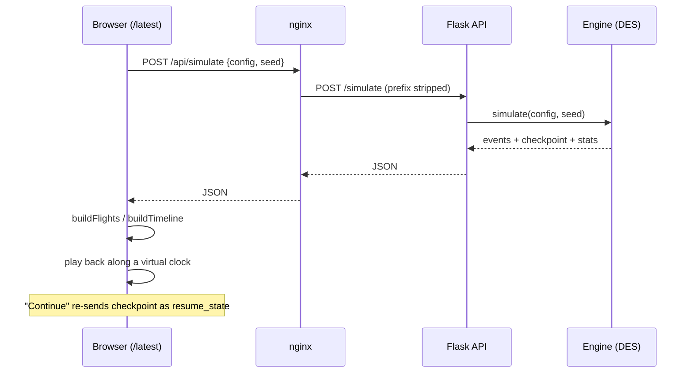
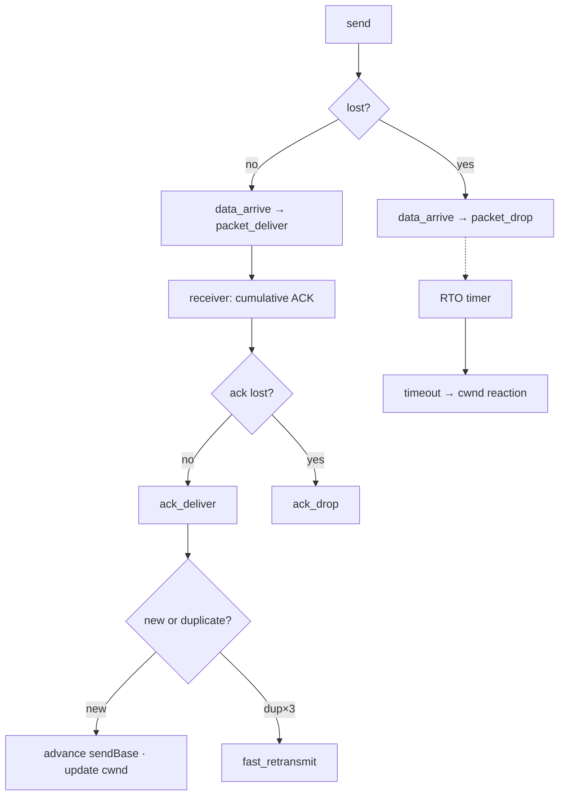

# Data flow

### Request → trace → playback (`/latest`)

```mermaid
sequenceDiagram
  participant U as Browser (/latest)
  participant N as nginx
  participant A as Flask API
  participant E as Engine (DES)
  U->>N: POST /api/simulate {config, seed}
  N->>A: POST /simulate (prefix stripped)
  A->>E: simulate(config, seed)
  E-->>A: events + checkpoint + stats
  A-->>N: JSON
  N-->>U: JSON
  U->>U: buildFlights / buildTimeline
  U->>U: play back along a virtual clock
  Note over U: "Continue" re-sends checkpoint as resume_state
```

### Packet lifecycle inside the engine

```mermaid
flowchart TD
  S[send] --> T{lost?}
  T -- no --> D[data_arrive → packet_deliver]
  T -- yes --> X[data_arrive → packet_drop]
  D --> R[receiver: cumulative ACK]
  R --> AK{ack lost?}
  AK -- no --> AD[ack_deliver]
  AK -- yes --> AX[ack_drop]
  AD --> NEW{new or duplicate?}
  NEW -- new --> CC[advance sendBase · update cwnd]
  NEW -- dup×3 --> FR[fast_retransmit]
  X -.-> RTO[RTO timer]
  RTO --> TO[timeout → cwnd reaction]
```
