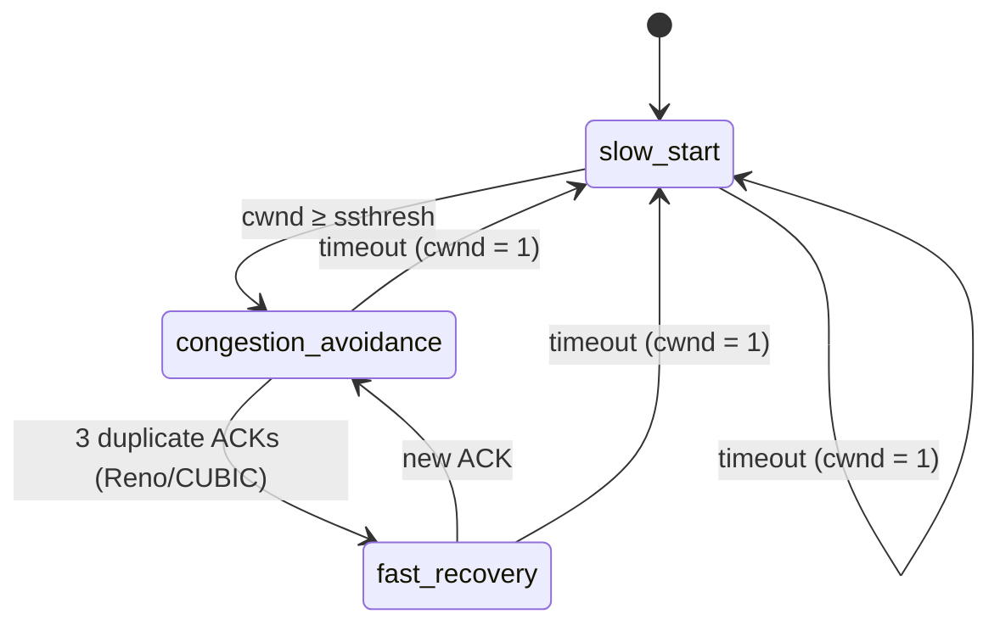

# Event trace — state model

The engine emits a flat list of timestamped events. The player derives everything
from them: paired *flights* for the ladder, and a per-event *state timeline* for
the readouts and charts.

