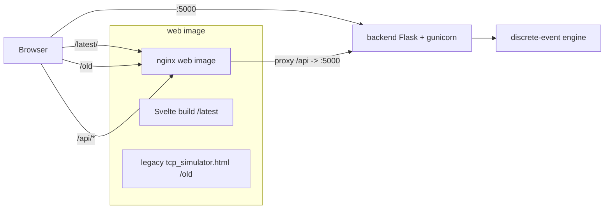

Two container images are built:

- **`backend`** — `python:3.12-slim` running `gunicorn app:app` on port `5000`.
- **`web`** — a multi-stage image: a `node:20-alpine` stage builds the Svelte app,
  and an `nginx:alpine` stage serves the build under `/latest`, the legacy page
  under `/old`, and proxies `/api` to the backend.

The simulation logic lives once, in `backend/engine`, and is mirrored by a
JavaScript port used by the `/old` page — see [How It Works](#how-it-works).
